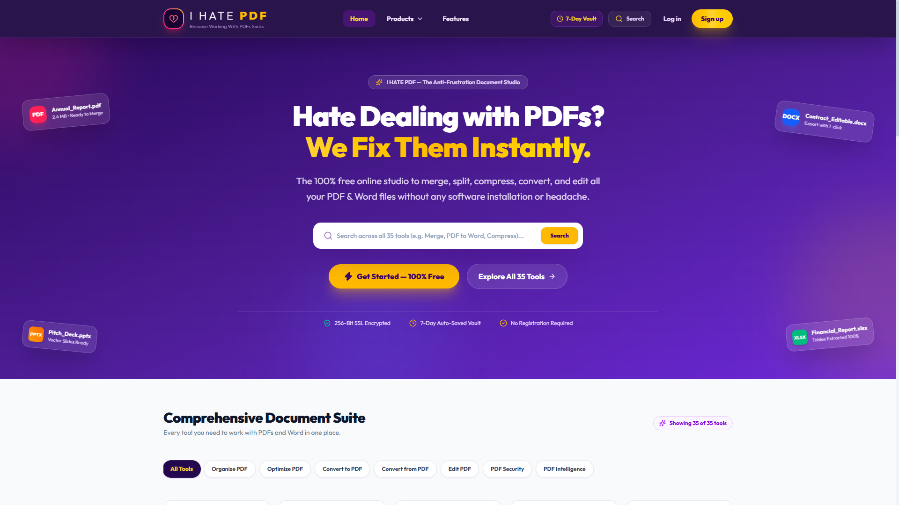
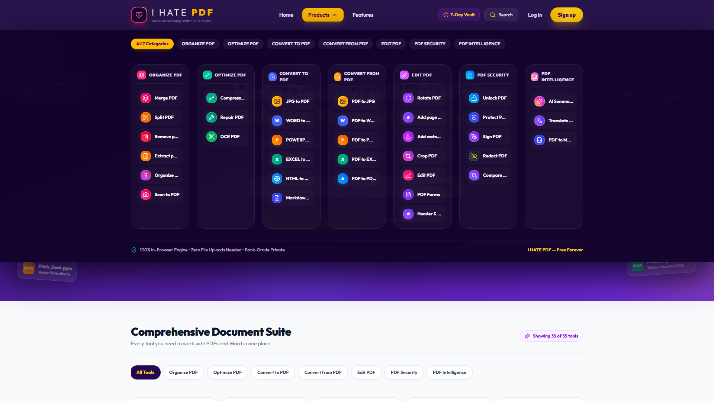

<div align="center">

# 📄 I Hate PDF


[](https://opensource.org/licenses/MIT)

A blazing fast, client-side PDF manipulation utility suite designed to perform all operations directly in your browser. No files are uploaded to any server, ensuring complete data privacy and lightning-fast speeds.

**Live Demo:** [https://wehatepdf.vercel.app/](https://wehatepdf.vercel.app/)

</div>

---

<p align="center">
  
  <br/>
  
</p>

## ✨ Features

- **Merge PDF:** Combine multiple PDF files into one.
- **Split PDF:** Extract pages from a PDF.
- **Rotate PDF:** Rotate pages visually and save.
- **Organize PDF:** Drag and drop to reorder or remove pages.
- **Client-Side Only:** Powered by `pdf-lib` and React. Your files never leave your device!

## 💻 Local Development

Follow these steps to run the project locally on your machine:

```bash
# 1. Clone the repository
git clone https://github.com/dharani2006lakshmi-sys/ihatepdf.git

# 2. Navigate into the directory
cd ihatepdf

# 3. Install dependencies
npm install

# 4. Start the development server
npm run dev
```

## 🤝 Contributing
Contributions are always welcome! Please read the [Contributing Guide](CONTRIBUTING.md) to get started.

## 📝 License
This project is open-source and available under the [MIT License](LICENSE).
